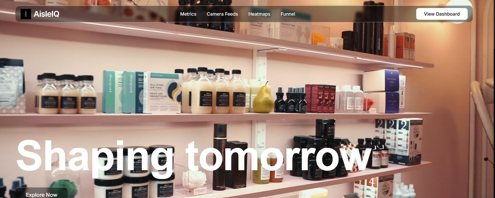
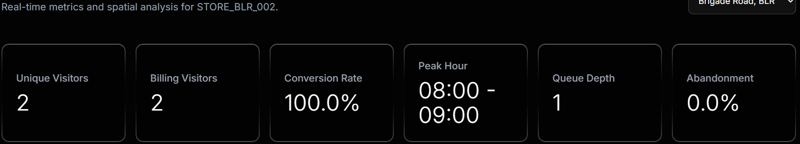
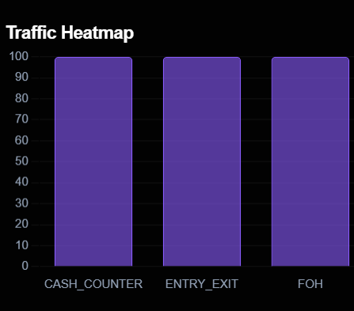
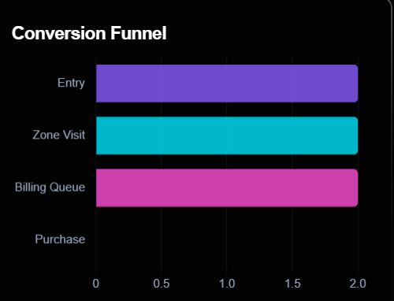
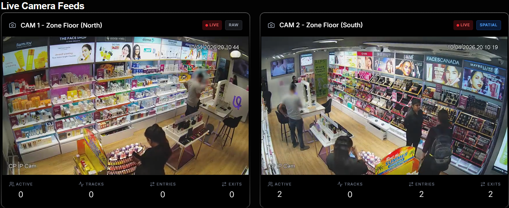

<div align="center">
  

  # AisleIQ
  
  **Retail analytics pipeline that processes CCTV footage and exposes a Store Intelligence API with a real-time React frontend.**

  [](https://python.org)
  [](https://fastapi.tiangolo.com/)
  [](https://reactjs.org/)
  [](https://postgresql.org/)
  [](LICENSE)

  <br />

  

</div>

---

## 🌍 Project Overview

**AisleIQ** bridges the gap between raw CCTV footage and actionable retail intelligence. It consolidates the ingestion of physical store interactions, seamless anomaly detection, and cross-camera Re-ID tracking into one clean, interactive web experience.

Originally engineered as a robust data pipeline, AisleIQ has been architecturally upgraded into a **production-ready platform**. It now boasts a React/Vite frontend, strict environment configuration, robust backend API routing, and scalable Dockerized deployments.

---

## ✨ Key Features

*   🏪 **Dynamic Store Analytics:** Track unique visitors, queue depths, and conversion funnels in real-time.
*   📊 **Heatmaps & Tracking:** Generate visitor density normalized scoring (heatmaps) across physical zones.
*   🕵️‍♂️ **Anomaly Detection:** Identify operational bottlenecks, staff absence, or severe dropoffs using sliding-window anomaly checks.
*   🚀 **Production-Ready Backend:** A hardened FastAPI server handling event ingestion, validations, and SQLite/PostgreSQL integration.
*   🛡️ **Idempotency & Scaling:** Bulk ingest camera-extracted visitor events ensuring data integrity via idempotency keys.
*   ☁️ **Cloud Storage & Streaming:** Streamlined asset management with compressed video outputs available directly in the dashboard.

---

## 🏗️ Architecture

AisleIQ utilizes a robust Python CV tracking pipeline to feed a FastAPI backend, which serves a modern React/Vite frontend interface.

```text
AisleIQ/
├── app/                    # FastAPI server & endpoints
│   ├── main.py             # Application entry point
│   ├── models.py           # SQLAlchemy database schemas
│   └── routers/            # API endpoints (events, stores, health)
├── frontend/               # React / Vite SPA
│   ├── src/                # Frontend source code & components
│   └── public/             # Static assets
├── pipeline/               # CV Tracking pipeline (YOLOv8 + OSNet ReID)
├── data/                   # Local database, store layouts, and clips
├── screenshots/            # Application media and galleries
└── docker-compose.yml      # Multi-container orchestration
```

### Request Flow
`CCTV Clips` ➡️ `CV Pipeline (pipeline/detect.py)` ➡️ `FastAPI Ingest (/events/ingest)` ➡️ `Database` ➡️ `React Frontend`

---

## 📸 Application Gallery

| Dashboard Overview | Heatmap Insights |
| :---: | :---: |
|  |  |

| Analytics Funnel | Camera Feeds |
| :---: | :---: |
|  |  |

---

## ⚙️ Installation & Local Development

**Prerequisites:** 
- [Node.js](https://nodejs.org/) v18.0+
- [Python](https://python.org/) 3.11+
- **Docker & Docker Compose** (Optional, for running PostgreSQL/API containers)

1. **Clone the repository:**
   ```bash
   git clone https://github.com/keesha-luthra/aisle-iq.git AisleIQ
   cd AisleIQ
   ```

2. **Configure your environment:**
   Create a `.env` file in the root directory by copying the example file:
   ```bash
   cp .env.example .env
   ```
   Ensure `DATABASE_URL` is set to your preferred database (SQLite or PostgreSQL).

3. **Install backend dependencies:**
   ```bash
   pip install -r requirements.txt
   ```

4. **Install frontend dependencies:**
   ```bash
   cd frontend
   npm install
   ```

5. **Start the local services:**
   *Backend (FastAPI):*
   ```bash
   uvicorn app.main:app --host 127.0.0.1 --port 8000
   ```
   *Frontend (React):*
   ```bash
   cd frontend
   npm run dev
   ```
   *Navigate to `http://localhost:5173`*

---

## 🏃 Running the Detection Pipeline

To process video files and output local structured event streams:
1. Ensure your videos are placed inside a folder (e.g. `./data/clips`).
2. Run the detection pipeline to process clips and ingest them into the API:

   ```bash
   python scripts/run_pipeline_and_ingest.py --clips-dir ./data/clips --store-id STORE_BLR_002
   ```

This tool will automatically:
- Confirm server status.
- Run YOLO object detection and Re-ID tracking.
- Generate and save events locally.
- Ingest them in batches to the `/events/ingest` endpoint.

---

## 🔒 Environment Variables

| Variable | Type | Default Value | Description |
| :--- | :--- | :--- | :--- |
| `DATABASE_URL` | `string` | `postgresql+asyncpg://postgres:postgres@db:5432/store_intel` | Database connection string. SQLite also supported for local dev. |
| `API_URL` | `string` | `http://localhost:8000` | Target endpoint base URL for the emitter and frontend. |
| `PORT` | `number` | `8000` | API exposure port. |
| `STALE_FEED_SECONDS` | `number` | `600` | Ingestion latency threshold in seconds before warning. |

---

## 🔮 Future Improvements

While AisleIQ has been structured for production readiness, our roadmap includes:

1. **Multi-Store Scaling:** Refactoring the frontend to handle 100+ stores simultaneously on a single map interface.
2. **Real-time WebSockets:** Pushing live event updates directly to the React interface rather than polling.

<div align="center">
  <br/>
  <p>Built with ❤️ for retail intelligence.</p>
</div>
